# Customer Churn Platform on Microsoft Fabric

**Power Apps / Dataverse → Fabric Lakehouse → ML with drift-triggered retraining → Power BI, with data-quality, fairness and traceability checks mapped to ISO 42001.**

An end-to-end, automated churn solution: employees capture customer data in a Power App, a daily Fabric pipeline validates it, checks the model for drift, retrains when needed and refreshes the Power BI reports. Built on the public IBM Telco dataset, so this is a **portfolio project on demo data**, not a production system.

## Architecture at a Glance

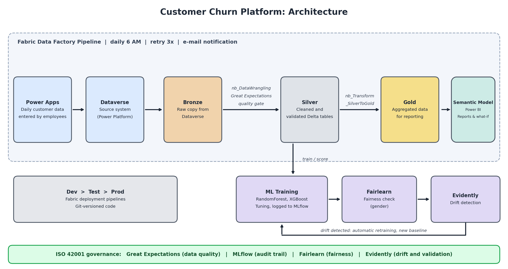

## Key Results

| Area | Result |
| :--- | :--- |
| Business insight | Overall churn 27 %. Month-to-month customers churn earliest. 2-year contracts churn < 5 %, 1-year contracts ~15 % |
| Retention scenario | ~103K yearly saved revenue in the example (30 % switch to 2-year contract, efficiency 0.35). This is a hypothesis, not a forecast |
| Model (RandomForest, selected) | AUC 0.827, recall 78 %, precision ≈ 49 % on the held-out test set (1,001 customers) |
| Fairness (gender) | Selection-rate gap 1.2 pp, true-positive-rate gap 2.4 pp. Groups are small (~500 each), so no significance claim |
| Automation | Daily 6 AM pipeline: ingest → clean → validate → drift check → conditional retraining → refresh reports |
| Governance | Great Expectations, MLflow, Fairlearn and Evidently, mapped to ISO 42001 controls |

## Contents

1. [Overview](#1-overview)
2. [Data](#2-data)
3. [Platform and Pipeline](#3-platform-and-pipeline)
4. [Power BI Report](#4-power-bi-report)
5. [ML Model](#5-ml-model)
6. [Governance and ISO 42001 Mapping](#6-governance-and-iso-42001-mapping)
7. [Limitations and Next Steps](#7-limitations-and-next-steps)
8. [How to Reproduce](#8-how-to-reproduce)
9. [Skills Demonstrated](#9-skills-demonstrated)

---

## 1. Overview

**Problem.** Acquiring a new customer typically costs several times more than retaining one (the ratio is industry-dependent). Understanding *who* leaves, *when* and *why* is therefore a core business question.

**Solution.** One platform on Microsoft Fabric:

- Loads daily data from Dataverse (Power Apps) into a Bronze Lakehouse
- Cleans the data in a notebook (`nb_DataWrangling`)
- Validates it with Great Expectations before it enters the Silver layer
- Trains and evaluates churn models on the Silver data
- Checks for data drift with Evidently. If drift is detected, the model is retrained automatically and the drift baseline is updated for the next day's comparison
- Writes aggregated data to the Gold layer and refreshes the Power BI semantic model and reports

**Outcome for management.** Changes in churn become visible the next morning, together with the contract types and tenure phases most at risk. The report translates findings into a what-if revenue scenario for a retention campaign.

---

## 2. Data

- **Source:** public [IBM Telco Customer Churn dataset](https://github.com/IBM/telco-customer-churn-on-icp4d/blob/master/data/Telco-Customer-Churn.csv), loaded into a Dataverse table `customerchurn` to simulate daily operational data from a Power App. Roughly 5,000 customers are used. Target: `Churn` (boolean, 27 % positive).
- **Features (excerpt):** customer id, gender, senior citizen, tenure, phone/internet/streaming services, contract type, payment method, monthly and total charges.
- **Missing values:** the original data is complete, so 600 cells were deleted at random to make cleaning realistic. Raw file: `data/raw/customerchurn_withmissing_data.csv`.

**Cleaning (`nb_DataWrangling`):**

- Remove duplicates
- Drop rows with missing values in selected columns, only where the missing share is below 5 %
- Fill missing boolean values with 0 (assumes "missing = No")
- Cast decimals to `decimal(12,2)`
- Drop unnecessary columns
- Save cleaned data as Parquet in the Bronze `Files` folder for validation

---

## 3. Platform and Pipeline

### Technology stack

| Layer | Technology | Purpose |
|---|---|---|
| Source | Power Apps, Dataverse | Daily data capture, managed data store |
| Orchestration | Fabric Data Factory | Scheduling, retries (3 × 60 s), email notification after each run |
| Storage | Fabric Lakehouse (Delta) | Bronze / Silver / Gold |
| Transformation | Python notebooks | Cleaning, validation, aggregation |
| Data quality | Great Expectations | Quality gate between Bronze and Silver |
| ML | scikit-learn, XGBoost, MLflow | Training, tuning, tracking, model registry |
| Monitoring | Evidently, Fairlearn | Drift detection, fairness check |
| Reporting | Power BI semantic model (star schema, DAX) | Dashboards and what-if scenario |

### Medallion layers

- **Bronze:** raw copy from Dataverse, no transformations (debugging and audit)
- **Silver:** deduplicated, null-handled, validated with Great Expectations
- **Gold:** aggregated, reporting-ready tables for the semantic model

### Workspaces and deployment

| Stage | Purpose |
|---|---|
| Development | Build pipeline, notebooks, semantic model and reports. Code versioned in Git. All debugging happens here |
| Test | Deploy via deployment pipeline, validate semantic model relationships and report behaviour, approve for production |
| Production | Deploy pipeline, semantic model and reports, publish in Power BI Service, daily refresh at 6 AM |

If production breaks: debug and fix in Development, then redeploy to Test and Production. Test and Production deploy the Gold layer only (simplified and cost-optimised).

### Pipeline

Runs daily at 6 AM so fresh data is available at the start of the working day.

### Notebooks (folder `notebooks/`)

| Notebook | Purpose |
|---|---|
| `nb_DataWrangling` | First cleaning step, output to Bronze `Files` |
| `nb_SetupDataContext_with_GreatExpectations` | Creates the expectation suite and checkpoint. Runs only if no checkpoint exists |
| `nb_ValidationWithGreatExpectations` | Validates cleaned data, then loads it into Silver |
| `nb_Transform_SilverToGold` | Aggregates Silver data into Gold |
| `ML_CustomerChurn-1821` | Trains, tunes, evaluates and registers the models (see [5](#5-ml-model)) |
| `nb_ML_Drift_Detection` | Drift check with Evidently. Triggers retraining if drift is detected |

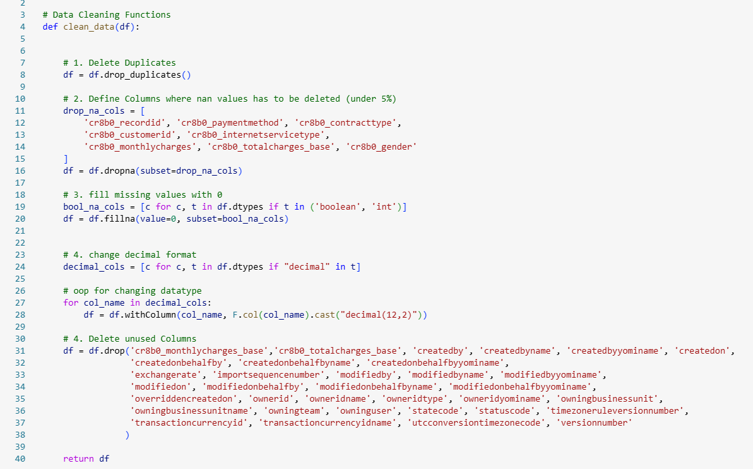

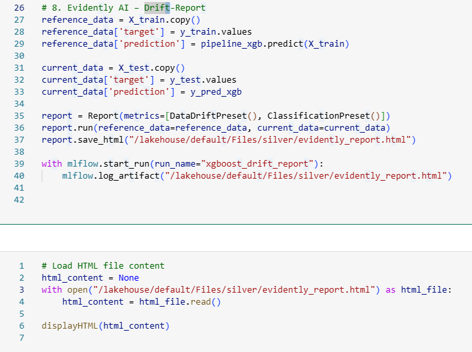

Great Expectations setup and validation screenshots

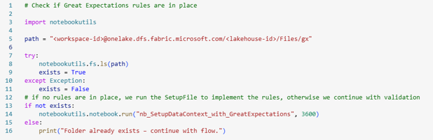
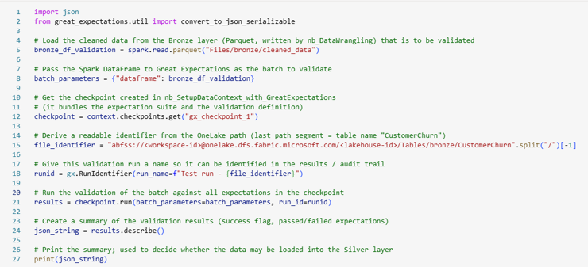
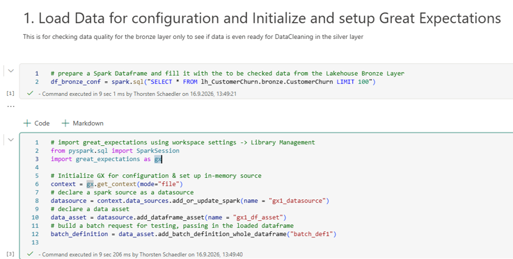
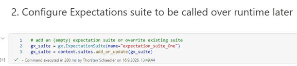
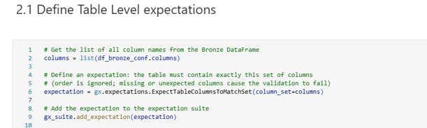
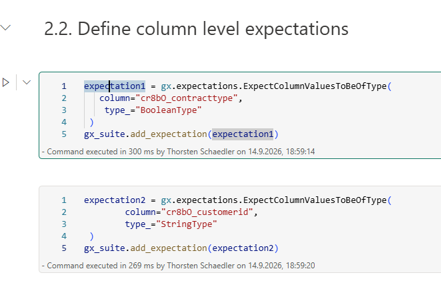
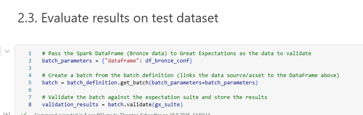
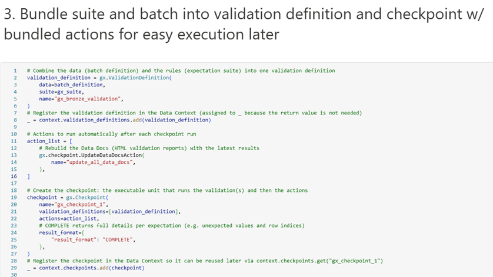
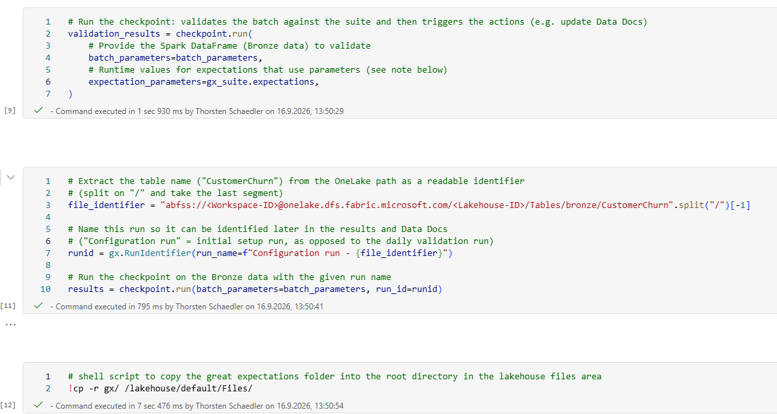

Required external libraries

Install them in one Fabric environment and use it for all notebooks.

---

## 4. Power BI Report

The report shows **when** customers leave, **which contract types** are most at risk and **how much revenue** a targeted retention campaign could save. Instead of a plain churn rate it uses **survival analysis** (Kaplan-Meier) and **hazard rates** to make the time dimension visible.

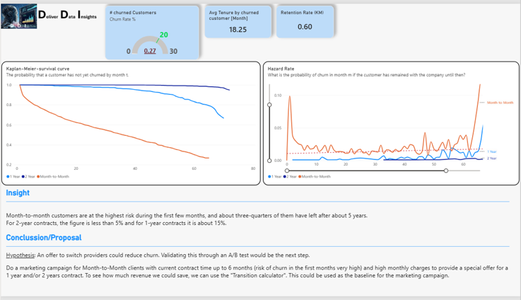

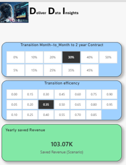

### Key findings

- Month-to-month customers carry the highest risk in the first months. Monthly churn probability peaks early, then drops
- About three quarters of month-to-month customers have left after roughly 5 years
- Longer contracts retain far better: 2-year contracts below 5 % churn, 1-year contracts ~15 %
- Overall churn rate is 27 %. Churned customers have an average tenure of 18.25 months

### Report pages

**1. Churn Insights**

| Visual | Question it answers |
|---|---|
| KPI cards (churn rate, average tenure of churned customers, retention rate) | How big is the problem? |
| Kaplan-Meier survival curve by contract type | What is the probability that a customer has not churned by month *t*? |
| Hazard rate by contract type | What is the probability of churn in month *m*, given the customer stayed until then? |
| Insight and conclusion | What should the business do? |

**2. Transition Calculator (what-if).** Two parameters drive the scenario:

- **Transition rate:** share of month-to-month customers who switch to a 2-year contract
- **Transition efficiency:** how much of the churn reduction seen in existing 2-year customers is realistically achieved after switching

Output: yearly saved revenue. In the example (30 % transition, 0.35 efficiency): ~103K.

### Recommendation

Target month-to-month customers with up to 6 months of tenure and high monthly charges with a special offer for a 1- or 2-year contract. The calculator provides the baseline for sizing the campaign.

> **Hypothesis:** an offer to switch contracts could reduce churn. Customers who choose a 2-year contract on their own are probably more loyal to begin with, so the scenario is not a forecast. The efficiency parameter makes this assumption explicit. An A/B test is the logical next step.

### Data model

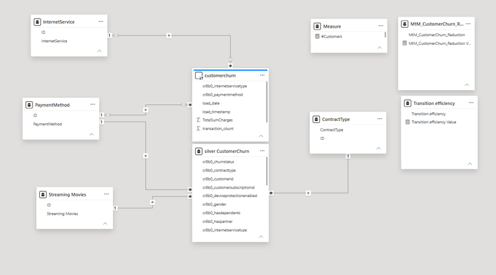

- **Fact table** `silver CustomerChurn`: one row per customer (churn status, tenure, charges, billing and service attributes, contract type)
- **Dimension tables** (4): `ContractType`, `InternetService`, `PaymentMethod`, `Streaming Movies`. One-to-many to the fact table, single-direction filtering
- **Source table** `customerchurn` with load metadata (`load_date`, `load_timestamp`)
- **What-if tables** `MtM_CustomerChurn_Reduction` and `Transition efficiency`: disconnected parameter tables feeding the scenario measure
- **Measure table** for report measures such as `#Customers`

### Key DAX measures

| Measure | Purpose |
|---|---|
| `Customers`, `Churned Customers`, `Churn Rate` | Base KPIs |
| `AvgTenureCustomerChurned` | Average tenure of churned customers |
| `Retention Rate (KM)` | Kaplan-Meier survival probability up to the selected month (product of monthly survival factors) |
| `Hazard Rate` | Churns in month *m* divided by customers still at risk in month *m* |
| `Saved Revenue (Scenario)` | Churned monthly revenue of month-to-month customers × transition rate × efficiency × relative churn gap to 2-year contracts |

### Methodological notes

- **Censoring:** active customers with short tenure have not churned *yet*. Kaplan-Meier handles this correctly, a simple churn rate does not
- **Small samples:** curves are hidden when fewer than 30 customers remain at risk. Hazard spikes at long tenures should not be over-interpreted

---

## 5. ML Model

Notebook: `notebooks/ML_CustomerChurn-1821.ipynb`

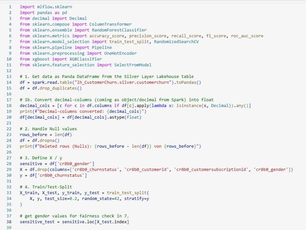

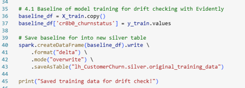

### Approach

Two tree ensembles are compared: **RandomForest** (bagging) and **XGBoost** (boosting). Churn data is structured and tabular, where tree ensembles usually perform well without heavy preprocessing. Each model is one scikit-learn `Pipeline`, so every step is fitted on training data only (no leakage):

1. One-hot encoding of categorical columns, numeric columns unchanged
2. Feature selection: an XGBoost model ranks features, `SelectFromModel` keeps those above the median
3. Classifier
   - RandomForest with `class_weight="balanced"`
   - XGBoost with `scale_pos_weight` (ratio of non-churners to churners)

### Tuning and tracking

`RandomizedSearchCV` with 30 iterations, 5-fold cross-validation and `scoring="f1"` for both models. F1 balances detection against false alarms during tuning. The final selection then prioritises recall (see below). Parameters, metrics and the full pipeline are logged to MLflow and registered as `ML_CustomerChurn-1821-rf` and `ML_CustomerChurn-1821-xgb`.

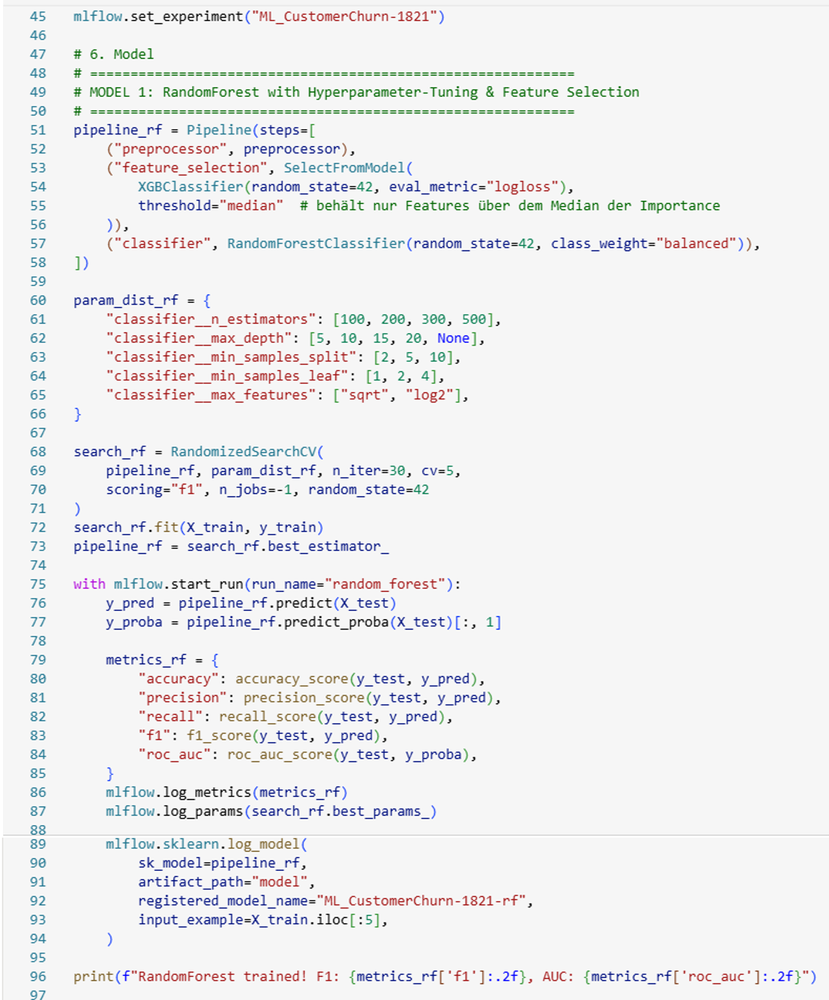

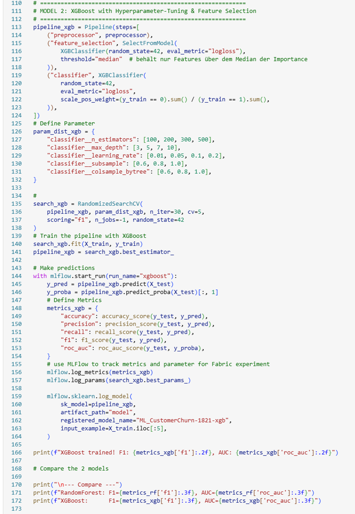

### Results (held-out test set, n = 1,001)

| Model | Accuracy | Precision | Recall | F1 | AUC |
| :--- | :---: | :---: | :---: | :---: | :---: |
| RandomForest | 0.724 | 0.487 | **0.781** | 0.600 | 0.827 |
| XGBoost | **0.736** | **0.501** | 0.770 | **0.607** | 0.827 |

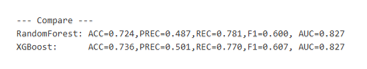

- **Precision (≈ 49 %):** of 100 flagged customers, about 49 actually churn
- **Recall (≈ 78 %):** of 100 true churners, the model catches about 78 and misses 22

### Model selection

The models are practically tied: identical AUC, F1 differs by 0.007. RandomForest was selected because of its slightly higher recall, on the assumption that a missed churner is more expensive than a wasted retention offer.

**Illustrative cost check.** Assumptions (not measured): cohort of 10,000 customers at the observed 27 % churn rate (2,700 churners), missed churner USD 250, false-alarm offer USD 50. Counts are derived from the test-set recall and precision.

| | RandomForest | XGBoost |
|---|---:|---:|
| Caught churners (TP) | 2,109 | 2,079 |
| Missed churners (FN) | 591 | 621 |
| False alarms (FP) | 2,222 | 2,071 |
| **Total cost (USD)** | **258,850** | **258,800** |

Cost does not separate the two models (difference < 0.1 %). XGBoost would be an equally defensible choice. A cost-based decision threshold (see [7](#7-limitations-and-next-steps)) would matter more than the model choice.

### Fairness check (Fairlearn, gender)

The Random Forest model was selected and evaluated on the held-out test set with `MetricFrame` (group sizes: 502 and 499). Both fairness metrics are logged to MLflow in a separate run.

| Metric | Group 0 | Group 1 | Difference |
| :--- | :---: | :---: | :---: |
| Accuracy | 0.7371 | 0.7355 | 0.0016 |
| Selection rate | 0.4124 | 0.4008 | 0.0115 |
| True positive rate (recall) | 0.7820 | 0.7576 | 0.0244 |
| False positive rate | 0.2791 | 0.2725 | 0.0067 |

- **Demographic parity difference:** 0.0115
- **Equalized odds difference:** 0.0244 (the larger of the TPR and FPR gaps)
- Both are well below the ~0.1 level at which a closer look is usually recommended

**Caveats:** only one attribute was assessed. With about 500 customers per group (roughly 130 churners each at 27 % churn), gaps of this size cannot be statistically distinguished from zero. No mitigation was applied.

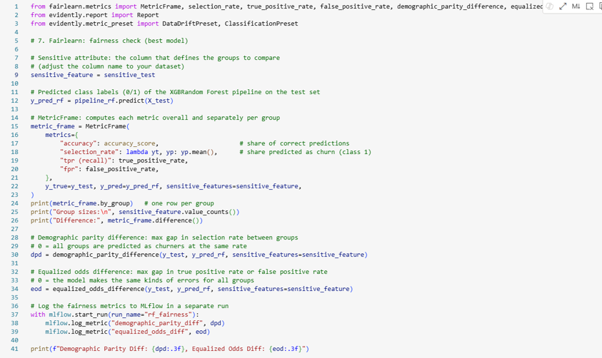

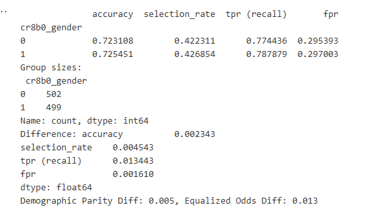

---

## 6. Governance and ISO 42001 Mapping

ISO 42001 is a management-system standard for organisations. The tools below produce evidence that **supports** selected controls. They do not establish conformity on their own. The mapping is indicative.

| Tool | What it does here | ISO 42001 reference |
|---|---|---|
| Great Expectations | Quality gate between Bronze and Silver, checkpoints as evidence | Annex A.4.3 (data resources), A.7.4 (quality of data) |
| MLflow | Logs every training run, versions and registers models | Clause 7.5 (documented information), A.6.2.4 (verification and validation) |
| Fairlearn | Group-level fairness metrics per model | Annex A.5 (assessing impacts of AI systems) |
| Evidently | Drift detection, trigger for retraining | Annex A.6.2.6 (operation and monitoring) |

Operational controls in the platform: separate Dev/Test/Prod workspaces, workspace roles, retries and email notification per pipeline run.

---

## 7. Limitations and Next Steps

**Known limitations**

- Demo data: public dataset with artificially removed values, Power App usage simulated
- Static snapshot: drift and retraining logic is demonstrated, not proven on real time-series data
- No Logistic Regression baseline, so 0.827 AUC is not benchmarked against a simple model
- Metrics come from one test split of 1,001 customers, without confidence intervals
- Decision threshold is the default (0.5), not cost-optimised
- One fairness attribute, small groups
- No automated tests for notebooks

**Next steps**

- Logistic Regression baseline, class-imbalance handling, cost-based threshold optimisation (retention offer vs. missed churner)
- SHAP explanations for individual customers, probability calibration
- Write churn scores back to Dataverse and trigger retention campaigns with Power Automate
- A/B test retention offers
- Automated notebook tests and CI checks, alerts for pipeline failures, data-quality violations and drift
- Fabric Data Warehouse as serving layer (T-SQL access, write-back, centrally managed row/column-level security)
- Near-real-time ingestion with Eventstreams, further data sources (CRM, billing, support)
- Fairness monitoring for additional segments

---

## 8. How to Reproduce

The solution runs inside Microsoft Fabric and Power Platform and cannot be run locally. Requirements: a Fabric workspace with capacity (trial is sufficient) and a Power Platform environment with Dataverse.

1. Create the Dataverse table `customerchurn` and import `data/raw/customerchurn_withmissing_data.csv`
2. Create the Fabric workspaces (Dev, Test, Prod) and a Lakehouse with Bronze, Silver and Gold layers
3. Create a Fabric environment with the external libraries shown in section 3 and attach it to all notebooks
4. Import the notebooks from `notebooks/`
5. Build the Data Factory pipeline (copy job, notebooks in the order shown in the pipeline screenshot, retries, email notification) and schedule it for 6 AM
6. Connect the Power BI semantic model to the Gold/Silver tables and publish the report

---

## 9. Skills Demonstrated

- **Data engineering:** medallion architecture, Fabric Data Factory pipelines, Lakehouse (Delta), Python/pandas transformation, data validation with Great Expectations
- **Analytics and BI:** star schema, DAX including Kaplan-Meier and hazard-rate measures, what-if scenario modelling, Power Query
- **Data science:** scikit-learn pipelines, feature selection, hyperparameter tuning, MLflow tracking and model registry, drift detection with Evidently
- **Responsible AI:** fairness assessment with Fairlearn, ISO 42001 control mapping
- **Delivery:** Dev/Test/Prod deployment pipeline, Git versioning, scheduled and monitored pipeline runs
- **Power Platform:** Power Apps and Dataverse as source system

---

## License

MIT License. The dataset originates from IBM (see link in section 2).

**Last updated:** 2026-09-30
